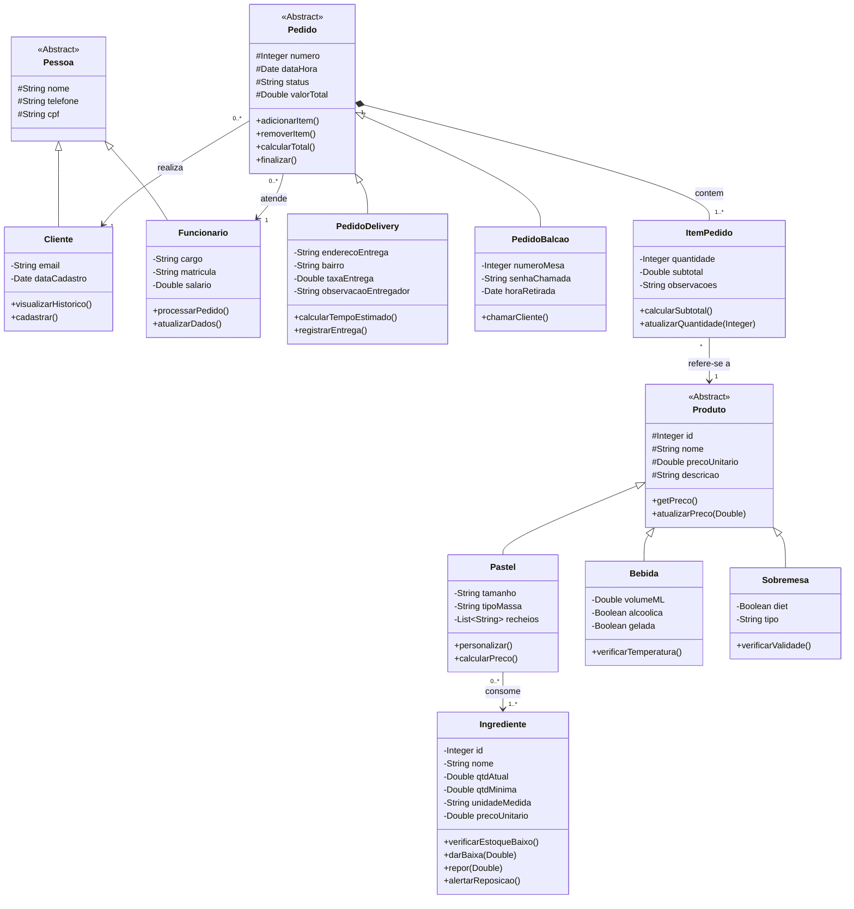

# Diagrama de Classes UML - Sistema Pastelaria "Tio do Pastel"

## Diagrama em Formato Mermaid

---

## Dicionário de Classes

### 1. Classe Abstrata: Pessoa

| Atributo | Tipo | Visibilidade | Descrição |
|----------|------|--------------|-----------|
| nome | String | protected | Nome completo do indivíduo |
| telefone | String | protected | Contato telefônico |
| cpf | String | protected | Identificação federal |

**Métodos:** Nenhum (classe base apenas)

**Relacionamentos:** Superclasse de `Cliente` e `Funcionario`

---

### 2. Classe: Cliente

**Herança:** Estende `Pessoa`

| Atributo | Tipo | Visibilidade | Descrição |
|----------|------|--------------|-----------|
| email | String | private | Endereço de e-mail para contato |
| dataCadastro | Date | private | Data de registro no sistema |

| Método | Retorno | Descrição |
|--------|---------|-----------|
| visualizarHistorico() | List~Pedido~ | Retorna todos os pedidos realizados pelo cliente |
| cadastrar() | void | Registra novo cliente no sistema |

**Relacionamentos:** 
- Realiza 0..* `Pedido`

---

### 3. Classe: Funcionario

**Herança:** Estende `Pessoa`

| Atributo | Tipo | Visibilidade | Descrição |
|----------|------|--------------|-----------|
| matricula | String | private | Identificador único do funcionário |
| cargo | String | private | Função (Atendente, Cozinheiro, Gerente) |
| salario | Double | private | Remuneração mensal |

| Método | Retorno | Descrição |
|--------|---------|-----------|
| processarPedido() | void | Inicia o fluxo de produção/preparação |
| atualizarDados() | void | Modifica informações funcionais |

**Relacionamentos:** 
- Atende 0..* `Pedido`

---

### 4. Classe Abstrata: Produto

| Atributo | Tipo | Visibilidade | Descrição |
|----------|------|--------------|-----------|
| id | Integer | protected | Código único do produto |
| nome | String | protected | Nome comercial |
| precoUnitario | Double | protected | Valor de venda em reais |
| descricao | String | protected | Detalhes/características |

| Método | Retorno | Descrição |
|--------|---------|-----------|
| getPreco() | Double | Retorna o preço atual |
| atualizarPreco(Double novoPreco) | void | Modifica o valor de venda |

**Relacionamentos:** 
- Superclasse de `Pastel`, `Bebida`, `Sobremesa`
- Referenciada por `ItemPedido` (0..*)

---

### 5. Classe: Pastel

**Herança:** Estende `Produto`

| Atributo | Tipo | Visibilidade | Descrição |
|----------|------|--------------|-----------|
| tamanho | String | private | Dimensão (P, M, G, Tradicional) |
| tipoMassa | String | private | Variedade (Tradicional, Apimentada, Integral) |
| recheios | List~String~ | private | Lista de ingredientes principais |

| Método | Retorno | Descrição |
|--------|---------|-----------|
| personalizar() | Pastel | Permite customização de recheios |
| calcularPreco() | Double | Ajusta preço conforme tamanho/recheios |

**Relacionamentos:** 
- Consome 1..* `Ingrediente`

---

### 6. Classe: Bebida

**Herança:** Estende `Produto`

| Atributo | Tipo | Visibilidade | Descrição |
|----------|------|--------------|-----------|
| volumeML | Double | private | Capacidade em mililitros |
| alcoolica | Boolean | private | Indicador se contém álcool |
| gelada | Boolean | private | Indicador de serviço refrigerado |

| Método | Retorno | Descrição |
|--------|---------|-----------|
| verificarTemperatura() | Boolean | Valida se está na temperatura correta |

**Relacionamentos:** Nenhuma

---

### 7. Classe: Sobremesa

**Herança:** Estende `Produto`

| Atributo | Tipo | Visibilidade | Descrição |
|----------|------|--------------|-----------|
| diet | Boolean | private | Indicador se é versão diet/light |
| tipo | String | private | Categoria (Doce, Pudim, Bolo, etc.) |

| Método | Retorno | Descrição |
|--------|---------|-----------|
| verificarValidade() | Boolean | Valida se não expirou |

**Relacionamentos:** Nenhuma

---

### 8. Classe Abstrata: Pedido

| Atributo | Tipo | Visibilidade | Descrição |
|----------|------|--------------|-----------|
| numero | Integer | protected | Identificador único da comanda |
| dataHora | Date | protected | Data e hora do registro |
| status | String | protected | Estado (Preparando, Pronto, Entregue, Cancelado) |
| valorTotal | Double | protected | Soma de todos os itens + taxas |

| Método | Retorno | Descrição |
|--------|---------|-----------|
| adicionarItem(Produto, quantidade) | void | Insere novo item no pedido |
| removerItem(ItemPedido) | void | Remove item da comanda |
| calcularTotal() | Double | Itera itens somando subtotais |
| finalizar() | void | Encerra pedido e dispara baixa no estoque |

**Relacionamentos:** 
- Superclasse de `PedidoDelivery`, `PedidoBalcao`
- Contém 1..* `ItemPedido` (composição)
- Realizado por 1 `Cliente`
- Atendido por 1 `Funcionario`

---

### 9. Classe: PedidoDelivery

**Herança:** Estende `Pedido`

| Atributo | Tipo | Visibilidade | Descrição |
|----------|------|--------------|-----------|
| enderecoEntrega | String | private | Logradouro completo de destino |
| bairro | String | private | Bairro do cliente |
| taxaEntrega | Double | private | Valor adicional de frete |
| observacaoEntregador | String | private | Instruções especiais (ex: "Buzar") |

| Método | Retorno | Descrição |
|--------|---------|-----------|
| calcularTempoEstimado() | Integer | Minutos baseado em distância e fila |
| registrarEntrega() | void | Marca como entregue e registra hora |

**Relacionamentos:** Nenhuma adicional

---

### 10. Classe: PedidoBalcao

**Herança:** Estende `Pedido`

| Atributo | Tipo | Visibilidade | Descrição |
|----------|------|--------------|-----------|
| numeroMesa | Integer | private | Identificação do balcão/local |
| senhaChamada | String | private | Código para chamar cliente (ex: "A15") |
| horaRetirada | Date | private | Horário em que o cliente retirou |

| Método | Retorno | Descrição |
|--------|---------|-----------|
| chamarCliente() | void | Exibe alerta/som com a senha |

**Relacionamentos:** Nenhuma adicional

---

### 11. Classe Associativa: ItemPedido

**Propósito:** Resolve relação N:N entre `Pedido` e `Produto`, armazenando dados específicos de cada linha de venda

| Atributo | Tipo | Visibilidade | Descrição |
|----------|------|--------------|-----------|
| quantidade | Integer | private | Número de unidades daquele produto |
| subtotal | Double | private | Snapshot do valor (qtd × preço) |
| observacoes | String | private | Customizações (ex: "sem cebola", "bem passado") |

| Método | Retorno | Descrição |
|--------|---------|-----------|
| calcularSubtotal() | Double | Retorna quantidade × preço unitário |
| atualizarQuantidade(Integer novaQtd) | void | Modifica quantidade e recalcula subtotal |

**Relacionamentos:** 
- Referencia 1 `Produto`
- Pertence a 1 `Pedido` (composição)

---

### 12. Classe: Ingrediente

| Atributo | Tipo | Visibilidade | Descrição |
|----------|------|--------------|-----------|
| id | Integer | private | Código único do insumo |
| nome | String | private | Descrição (ex: "Carne Moída", "Óleo") |
| qtdAtual | Double | private | Quantidade em estoque no momento |
| qtdMinima | Double | private | Ponto de reposição (gatilho de alerta) |
| unidadeMedida | String | private | Unidade (kg, litro, unidade, etc.) |
| precoUnitario | Double | private | Valor de compra por unidade |

| Método | Retorno | Descrição |
|--------|---------|-----------|
| verificarEstoqueBaixo() | Boolean | Retorna true se qtdAtual < qtdMinima |
| darBaixa(Double quantidade) | void | Subtrai do estoque e verifica alerta |
| repor(Double quantidade) | void | Adiciona quantidade ao estoque |
| alertarReposicao() | void | Dispara notificação quando estoque baixo |

**Relacionamentos:** 
- Consumido por 1..* `Pastel`

---

## Notas Técnicas

### Visibilidade em UML
- `+` Public (público)
- `-` Private (privado)
- `#` Protected (protegido)
- `~` Package (pacote)

### Multiplicidades
- `1` Exatamente um
- `0..*` Zero ou muitos
- `1..*` Um ou muitos
- `*` Muitos (equivalente a 0..*)

### Tipos de Relacionamentos
- **Herança (Seta branca fechada):** Generalização/Especialização
- **Composição (Losango preto):** Relação forte (ItemPedido não existe sem Pedido)
- **Associação (Seta preta):** Relação comum entre entidades
- **Classe Associativa:** Classe que conecta duas outras com atributos próprios

### Requisitos Atendidos
✓ Produtos especiais (Pastel com recheios e características)  
✓ Diferenciação de Pedidos (Delivery e Balcão)  
✓ Múltiplos produtos por pedido (via ItemPedido)  
✓ Sistema de alerta de estoque (método `verificarEstoqueBaixo()`)  
✓ Herança aplicada (Pessoa, Produto, Pedido)  
✓ Classe Associativa (ItemPedido)  
✓ Notação UML correta com multiplicidades